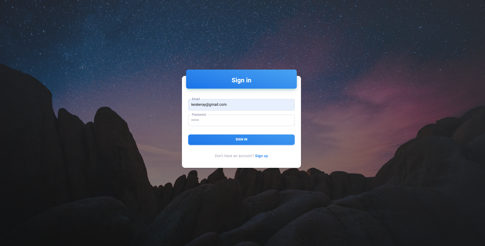
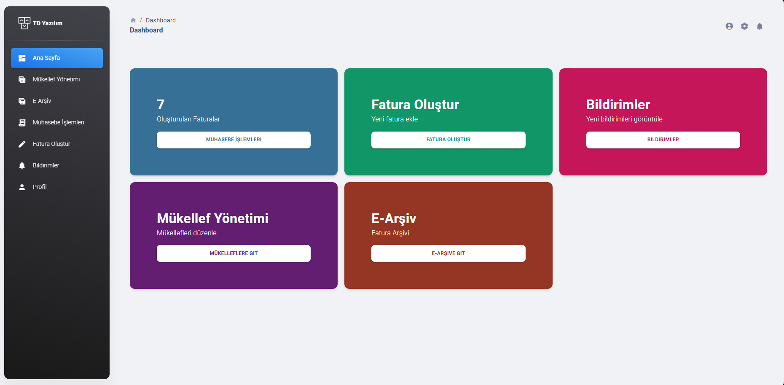

# Bitirme Projesi - TD Yazılım

Bu proje, üniversite bitirme projem olarak geliştirdiğim bir **web tabanlı mali müşavirlik platform** uygulamasıdır. 

## 🔧 Kullanılan Teknolojiler

- React.js
- Material UI (MUI)
- JavaScript / JSX

## 🧠 Projenin Amacı

Bu proje, mali müşavirler için geliştirilen bir web tabanlı muhasebe yönetim platformudur. Sistem üzerinden e-Fatura ve e-Arşiv işlemleri gerçekleştirilirken, mükellef yönetimi ve fatura oluşturma gibi temel muhasebe süreçleri kullanıcı dostu bir arayüz ile sunulmaktadır.

## ✨ Yaptığım Geliştirmeler

Mükellef (vergi mükellefi) yönetim modülü geliştirildi

e-Fatura ve e-Arşiv işlemleri için fatura oluşturma ve görüntüleme ekranları hazırlandı

Dashboard üzerinden fatura istatistikleri ve kullanıcı özetleri sunuldu

Giriş ve kayıt işlemleri özelleştirildi

Tema ve bileşenlerde sade ve profesyonel bir görünüm sağlandı


## 📸 Ekran Görüntüleri

### 1. Ana Panel Görünümü



### 2. Giriş Sayfası Görünümü



## 🚀 Kurulum

1. Node.js kurulu olduğundan emin olun: [https://nodejs.org/](https://nodejs.org/)
2. Terminali açın:
```bash
npm install
npm start
